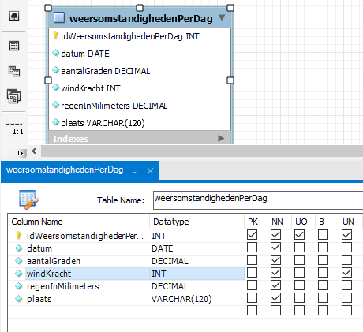

# design

We gaan weer van design naar een table werken

## Directory

- maak een directory in je `M6PROG` met de naam:
    - `opdrachten`
        - maak daarin de directory:
            - `01 design`
    
## Even herhalen, samen

Stel we hebben de volgende `table`:
- weersomstandighedenPerDag

Met deze `eigenschappen` (`colommen`):
- Datum
- Plaats
- aantalGraden
- windKracht
- regenInMilimeters

Hoe maken we dan de table?

Gebruik `mysql workbench`  
- druk op:
    >   
- dan kan je tabellen maken:
    > 
      

## Datatypes:

laten we de `datatypes` bedenken:

> - idWeersomstandighedenPerDag => ID => `INT`
> - Datum => `Date`
> - Plaats => woorden => `varchar(120)`
> - aantalGraden => 35.5? dus met punt => `decimal`
> - windKracht => hele getallen => `INT`
> - regenInMilimeters => in milimeters, dus hele getallen =>  `DECIMAL`

En nu bedenken of de `colommen` nog `speciale regels` hebben: 

> Als je een dag in deze table zet, moeten al deze colommen gevuld worden:
> - Alles is `NN` (`NOT NULL`)
> - de `ID colom` van de `tabel`:
>       - mag `nooit leeg` zijn
>       - is altijd `boven` de `0` (geen negatieve getallen) 
>       - is `uniek`

- Zet dat in je diagram:

 

## Klaar?

- maak een screenshot
    - sla die op als `04 weer diagram.png`
- bewaar het model als `weeroefening.mwb`
- commit naar je github
