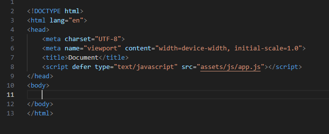

method="POST" TODO 

## Html

We gaan deze keer met html een formulier maken. De data uit dit formulier wordt later dan naar een server gestuurd en daar verwerkt. Denk bijvoorbeeld aan contact of nieuwe account formulieren. Maar ook een bericht op zoiets als discord gebruikt dezelfde technieken.


## files maken

- maak een directory in je `M6PROG` met de naam:
    - `opdrachten`
        - maak daarin de directory:
            - `02 formulieren`
- maak de volgende files aan in `02 formulieren`:
    - `search.html`
    - `naw.html`
- maak een directory in je `02 formulieren` met de naam:
    - `assets`
        - maak daarin de map `js`
            - maak in js de file `app.js`

## HTML inhoud

laten we beginnen met het opzetten van de html:

- neem de volgende code over (in `search.html`)
</br>

- lees de volgende pagina:
   -  https://www.w3schools.com/html/html_forms.asp

## hoe werkt het?

- bekijk deze code: (uit w3 schools)
</br>

> #### UITLEG
> - je ziet de action (`/action_page.php`) dat is het adres waar de data heengaat
> - de `label` is om het formulier leesbaarder te maken
> - het `input` element is waar de data door de gebruiker ingevoerd wordt
> - het `input` element heeft een attribuut `name`, die wordt ook meegestuurd
> - het `input` element heeft een attribuut `value`, die wordt ook meegestuurd

## Search formulier

- open je `search.html` in `visual studio code`
- Maak nu zelf een formulier voor de met 1 invul veld:
    - Search

## Testen
- open je directory waar `search.html` instaat in een `terminal`
- type in:
    - `php -S localhost:4000`
    > dit start `php` als een `webhost`
- open `http://localhost:4000/search.html` in je browser
- maak een screenshot van je search formulier:
    - noem de file `01 htmlsearchform.png`

## Action

- wij veranderen nu de action naar `search.php`
- die php file maken we nu aan `search.php` file ook alvast
- zet alvast je php tag erin:
```php
<?php
//hier komt je code
?>
```

## Testen

- open je `form.html` in je browser
- vul wat in en click op `submit`
- controlleer of je nu naar de pagina `search.php` gaat:
</br>

> #### UITLEG
> Zie je dat je nu de `url` krijgt met `?search=mario`
> - Dit komt omdat een `form` standaard een `GET request` verstuurt
> - dit is nog vrij oldschool, later gaan we dit met javascript doen en zorgen dat we niet naar de `.php` gaan


## Klaar?
- commit naar je github