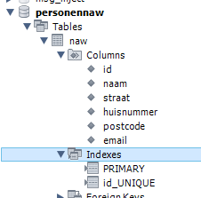

## Naw table

wat hadden we ook alweer gemaakt? Een formulier met:
- Naam
- Straat
- Huisnummer
- Postcode
- Email adres

en we hadden er een `method="POST"` van gemaakt, ook konden we het in `php` lezen

## Opzetten

- maak een nieuwe directory:
    - `04 inserts`
- kopieeer je werk in `02 formulieren` naar `04 inserts`
- maak een sql file aan:
    - `01 m6prog.sql`

## Table maken

> HINT check je `sql` van ` design naar table.md`

- open `01 naw.sql` in je `visual studio code`
- type eerst je `USE`:
        - `use m6prog;`
> `CREATE SCHEMA` is niet nodig omdat docker dit voor je doet

- we gaan nu een `create table` gebruiken om de volgende table te maken:
    - de table krijgt de naam `naw`
    - de table krijgt de volgende colommen:
        - id, een `INT` (unsigned), `NOT NULL` , `AUTO_INCREMENT`
        - naam, een `varchar(100)`,  `NOT NULL`,
        - straat, een `varchar(100)`,  `NOT NULL`,
        - huisnummer, een `varchar(6)`,  `NOT NULL`,
        - postcode, een `varchar(6)`,  `NOT NULL`,
        - email, een `varchar(120)`,  `NOT NULL`,   
    - de primary key wordt `id`
    - `id` moet een `unqiue index` krijgen

## Uitrollen

- rol je script uit in je docker
    > HINT: dit kan via `phpmyadmin` of `HeidiSQL` of `mysqlworkbench`

- controlleer of je uitrol goed gegaan is:

 
- check of je tabel er goed uitziet, zoals deze:
 

## Klaar?
- commit naar je github