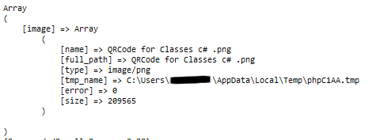

## Images uploaden

we gaan nu ervoor zorgen dat we een image kunnen uploaden naar PHP

## HTML

- maak een nieuwe html file:
    - `imageupload.html`

- zet in je html:
> </br>

#### UITLEG
> - zie je dat we een enctype daar nu hebben staan? deze hebben we nodig om groter files te kunnen sturen
> - we hebben ineens 2 nieuwe types:
>        - `hidden`
>        - `file`
> - ook hebben we een `accept` attribute bij de `file` input
>   - voor nu accepteren we alleen `.png` files


## php


- maak een nieuwe php file:
    - `imagereceive.php`
- zet daar je standaard php tag in:
```php
<?php
//code komt hier
?>
```

- zet in je PHP voor nu dit neer:
> </br>

## testen

- laad je `imageupload.html`
- upload een png en kijk naar wat je terugkrijgt van php:
> </br>


#### UITLEG
> In Files zit dus:
> - een array (`[]`) bij de key `image`
>       - `image` is wat in ons formulier staat:
        > </br>
> verder zit er nog meer in:
> - `file size`, hoe groot is het plaatje in bytes
> - `tmp_name` waar staat de file op de server
> - `type`, welke `extensie` heeft de `file`
> - `error`, deze moet op `0` staan, anders is er iets mis

## openen

- ga naar de directory die bij `tmp_name` staat
- open het plaatje
    - lukt dat? mooi je upload heeft gewerkt!
    
 ## Klaar?
- commit naar je github
