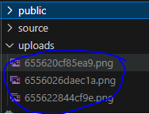

## Temp dir

We hebben nu ons bestand in de temp dir... dat willen we niet
we willen het in de `uploads` directory, BUITEN de `public`
> zo kan niemand erbij

## HOE DAN?

- open `imagereceive.php`
- maak daar een nieuwe `function` in:
>  
- daaronder zet je:
>  

#### UITLEG
> - we maken eerst een `$response` associative array aan:
>   - daarin zit een `succeeded` boolean en een `message` (voor fouten)
> - Daarna halen we de file `image` op uit `$_FILES`
> - Dan checken we of de upload gelukt is 
>   - is dat niet zo? geven we een fout terug
> - als laatst zetten we `$response` om in `json` en geven dat terug

## handleFile

En die handleFile dan?
Die is leeg daar moet nog wat in

- we maken eerst een unieke file name (Zet dit in `handleFile`):
>  
- dan pakken we de `tijdelijke locatie` & maken de `extentie` aan:
>  

- nu maken we een variable waar de NIEUWE locatie in komt:
>  

- nu kunnen we de file verplaatsen:
>  

## testen

tijd om te testen

- open je `imageupload.html`
    - upload een plaatje
        - check je upload directory:
            >  
- upload nog `3` plaatjes
- maak een screenshot van je `upload` directory
    - noem deze `06 uploads.png`

    
 ## Klaar?
- commit naar je github
